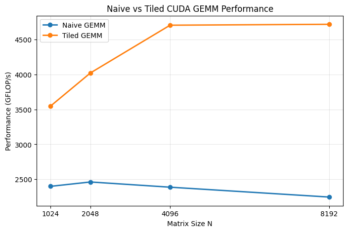

# CUDA GEMM Performance

A CUDA matrix multiplication study exploring how shared-memory tiling and
kernel configuration affect GEMM performance on an NVIDIA A100 GPU.

The project progresses from a naive GEMM implementation that directly accesses
global memory to a tiled implementation that stages matrix tiles in shared
memory for reuse. The kernels are benchmarked across matrix sizes and profiled
with NVIDIA Nsight Compute to investigate the hardware behavior behind the
observed performance differences.

## Implementations

### Naive GEMM

The naive kernel assigns one CUDA thread to each output element of matrix `C`.

For C = A × B,

each thread computes one dot product by iterating over the inner K dimension and
reading the required elements of A and B during the computation.

For N = 8192:

| Metric | Result |
|---|---:|
| Median Time | 461.691 ms |
| Performance | 2381.49 GFLOP/s |

### Shared Memory Tiled GEMM

The tiled implementation divides the matrices into smaller tiles. Threads in
a block cooperatively load tiles of A and B into shared memory, synchronize,
and reuse those values while accumulating their output elements.

This reduces repeated accesses through the global/cache memory path by
explicitly organizing reuse in shared memory.

## Tile / Block Configuration Experiment

For N = 8192, three square tile configurations were tested.

| Tile Size | Threads / Block | Median Time (ms) | Performance (GFLOP/s) |
|---:|---:|---:|---:|
| 8×8 | 64 | 383.353 | 2868.15 |
| 16×16 | 256 | 233.639 | 4706.03 |
| 32×32 | 1024 | 206.894 | 5314.37 |

Performance increased across the tested configurations, with the 32×32
configuration reaching approximately 5.31 TFLOP/s.

In this implementation, however, tile dimensions and block dimensions are
coupled: a T×T tile uses T² threads. The experiment therefore compares complete
kernel configurations rather than isolating tile size as a single independent
variable.

A 32×32 block already contains 1024 threads, the maximum number of threads
allowed in a CUDA thread block. Supporting larger data tiles would therefore
require changing the work decomposition rather than simply increasing the
dimensions of this one thread per output design.

## Controlled Naive vs. Tiled Comparison

To isolate the effect of shared-memory tiling more carefully, both kernels were
run with the same 16×16 thread-block configuration across several square matrix
sizes.

| N | Naive (ms) | Tiled (ms) | Naive (GFLOP/s) | Tiled (GFLOP/s) | Speedup |
|---:|---:|---:|---:|---:|---:|
| 1024 | 0.894976 | 0.605184 | 2399.49 | 3548.48 | 1.479× |
| 2048 | 6.97907 | 4.27213 | 2461.63 | 4021.38 | 1.634× |
| 4096 | 57.5759 | 29.2183 | 2387.09 | 4703.86 | 1.971× |
| 8192 | 489.577 | 233.105 | 2245.84 | 4716.81 | 2.100× |

With block configuration held constant at 16×16, shared-memory tiling improved
GEMM performance at every tested matrix size. The measured speedup increased
from approximately 1.48× at N=1024 to 2.10× at N=8192.

The experiment demonstrates that explicitly organizing data reuse through
shared memory can substantially improve this GEMM implementation, and that the
benefit became larger for the larger workloads tested.

## Nsight Compute Analysis

The N=4096 controlled comparison was profiled using NVIDIA Nsight Compute with
both kernels using 16×16 thread blocks.

Both kernels used 32 registers per thread and achieved approximately 99%
occupancy, making occupancy an unlikely explanation for the performance
difference.

| Metric | Naive | Tiled |
|---|---:|---:|
| Registers / Thread | 32 | 32 |
| Static Shared Memory | 0 | 2.05 KB |
| Achieved Occupancy | 99.63% | 99.48% |
| Active Warps / Scheduler | 15.92 | 15.92 |
| Eligible Warps / Scheduler | 1.61 | 2.29 |
| Issue Slots Busy | 30.75% | 46.48% |
| SM Busy | 30.75% | 46.48% |
| Compute Throughput | 53.76% | 72.98% |
| Memory Throughput | 254.58 GB/s | 462.00 GB/s |

Despite having essentially identical occupancy, the tiled kernel had more
eligible warps per scheduler and substantially higher issue slot and SM
utilization.

Nsight reported large memory-related stalls for the naive kernel, including
long-scoreboard/L1TEX dependency stalls and load/store instruction queue
pressure. The tiled implementation reorganized reuse through shared memory,
allowing warps to spend less time waiting on the global/cache memory path and
letting the schedulers issue useful work more frequently.

An important observation is that **high occupancy alone did not imply high
utilization**. Both kernels kept roughly the same number of warps resident, but
the tiled kernel kept more of those warps ready to execute.

> Shared-memory tiling reorganized data reuse so that warps spent less time
> blocked on the global/cache memory path, allowing the scheduler to issue
> useful work more frequently even though occupancy remained essentially
> unchanged.

## Methodology

Kernel execution time was measured using CUDA events after warm-up runs.
Multiple measurements were collected and median execution time was used for
benchmark comparisons.

For square N×N GEMM, performance was calculated using approximately:

GFLOP/s = 2N³ / (time × 10⁹)

where each multiply-accumulate contributes approximately two floating-point
operations.

All benchmarked outputs were checked for correctness.

Nsight Compute measurements were collected separately from normal benchmark
timings. Profiling requires multiple replay passes and introduces substantial
measurement overhead, so profiler durations are used for diagnosis rather than
as benchmark performance results.

## Environment

- GPU: NVIDIA A100-SXM4-40GB
- CUDA Compiler: NVIDIA `nvcc` 12.8 (V12.8.93)
- Profiler: NVIDIA Nsight Compute
- Environment: Google Colab

## Key Takeaways

- Shared-memory tiling improved performance over the naive implementation
  across every matrix size in the controlled comparison.
- At N=8192, the controlled 16×16 tiled implementation achieved approximately
  4.72 TFLOP/s and a 2.10× speedup over naive GEMM.
- Larger tile/block configurations improved performance in the tested tiled
  implementation, reaching approximately 5.31 TFLOP/s with 32×32, although
  tile size and thread-block size were not independently controlled.
- High occupancy did not guarantee high GPU utilization.
- Profiling showed that the primary difference between the controlled kernels
  was not occupancy, but how effectively resident warps could make progress.
- Explicit shared-memory reuse reduced waiting on the global/cache-memory path
  and increased scheduler and compute utilization.